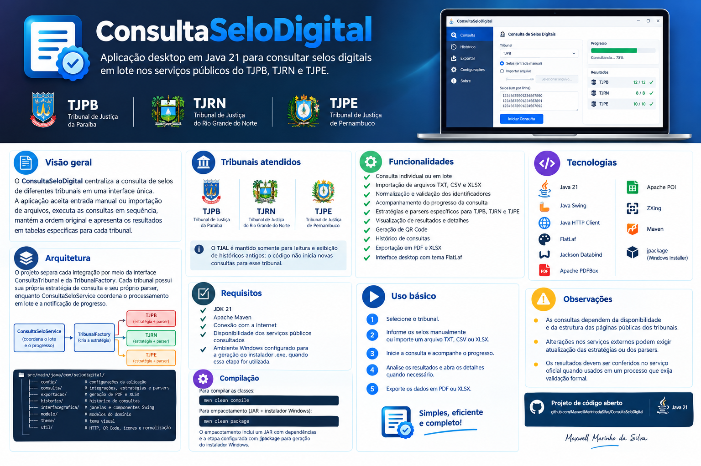

# ConsultaSeloDigital

Aplicação desktop em Java 21 para consultar selos digitais do TJPB, TJRN e TJPE e abrir consultas do TJAL no portal oficial.

<div align="center">
  
</div>

## Visão geral

O ConsultaSeloDigital centraliza a consulta de selos de diferentes tribunais em uma interface única. A aplicação aceita entrada manual ou importação de arquivos, executa as consultas em sequência, mantém a ordem original e apresenta os resultados em tabelas específicas para cada tribunal.

## Tribunais atendidos

- Tribunal de Justiça da Paraíba — TJPB;
- Tribunal de Justiça do Rio Grande do Norte — TJRN;
- Tribunal de Justiça de Pernambuco — TJPE;
- Tribunal de Justiça de Alagoas — TJAL (abertura assistida no navegador).

TJPB e TJRN são consultados diretamente pela aplicação; TJPE segue o fluxo de consulta implementado no projeto. Para o TJAL, o botão **Abrir no TJAL** abre a página correspondente no navegador padrão. Os dados e as validações permanecem sob responsabilidade do portal oficial do Tribunal, sem consulta automática pela aplicação.

## Funcionalidades

- consulta individual ou em lote;
- importação de selos por arquivos TXT, CSV e XLSX;
- normalização e validação dos identificadores conforme o tribunal;
- acompanhamento do progresso da consulta;
- estratégias e parsers específicos para TJPB, TJRN e TJPE;
- visualização de resultados e detalhes;
- geração de QR Code;
- histórico de consultas;
- exportação de resultados e detalhes em PDF e XLSX;
- interface desktop com tema FlatLaf.

## Tecnologias

- Java 21;
- Java Swing;
- Java HTTP Client;
- FlatLaf;
- Jackson Databind;
- Apache PDFBox;
- Apache POI;
- ZXing;
- Maven;
- `jpackage` para gerar uma imagem da aplicação no Windows (`app-image`), conforme o `pom.xml`.

## Arquitetura

As consultas diretas usam a interface `ConsultaTribunal` e a `TribunalFactory`, com estratégias e parsers próprios para TJPB, TJRN e TJPE. `ConsultaSeloService` coordena seu processamento em lote e a notificação de progresso. O TJAL usa apenas a abertura assistida do portal oficial.

```text
src/main/java/com/selodigital/
├── config/            # configurações da aplicação
├── consulta/          # integrações, estratégias e parsers
├── exportacao/        # geração de PDF e XLSX
├── historico/         # histórico de consultas
├── interfacegrafica/  # janelas e componentes Swing
├── modelo/            # modelos do domínio
├── theme/             # tema visual
└── util/              # HTTP, QR Code, ícones e normalização
```

## Requisitos

- JDK 21;
- Apache Maven;
- conexão com a internet;
- disponibilidade dos serviços públicos consultados;
- ambiente Windows com `jpackage` disponível para gerar a imagem da aplicação, quando essa etapa for utilizada.

## Compilação

Para compilar as classes:

```bash
mvn clean compile
```

Para executar o empacotamento definido no `pom.xml`:

```bash
mvn clean package
```

O empacotamento inclui um JAR com dependências e a etapa configurada com `jpackage` para gerar uma imagem da aplicação (`app-image`) no Windows.

## Uso básico

1. Selecione o tribunal.
2. Informe os selos manualmente ou importe um arquivo TXT, CSV ou XLSX.
3. Inicie a consulta e acompanhe o progresso.
4. Analise os resultados e abra os detalhes quando necessário.
5. Exporte os dados em PDF ou XLSX.

Para o TJAL, informe um selo e clique em **Abrir no TJAL** para abrir diretamente sua página oficial. Com vários selos, escolha na lista qual deseja abrir; somente uma página é aberta por ação. Os resultados são exibidos pelo próprio TJAL no navegador.

## Observações

- As consultas dependem da disponibilidade e da estrutura das páginas públicas dos tribunais.
- Alterações nos serviços externos podem exigir atualização das estratégias ou dos parsers.
- Os resultados devem ser conferidos no serviço oficial quando usados em um processo que exija validação formal.
